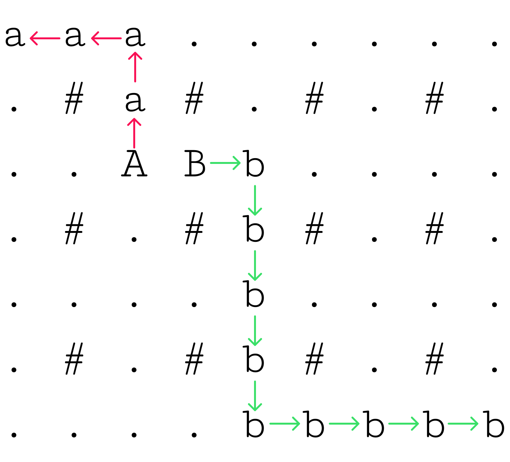
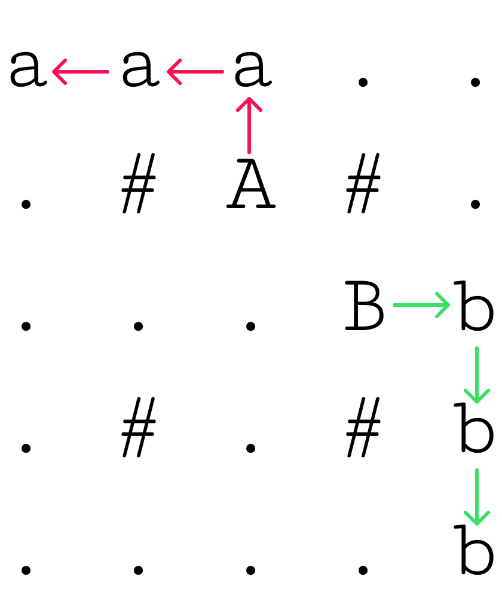

# Условие задачи `route`
Склад маркетплейса имеет форму прямоугольника и разбит на клетки площадью **1×1**. Общая площадь — **n×m**, где:

- **n** — количество строк (нумерация с 1 до n),
- **m** — количество столбцов (нумерация с 1 до m).

Известно, что **все клетки, у которых и номер строки, и номер столбца чётные**, заняты стойками (недоступны). Остальные клетки свободны для перемещения. Также известно, что **n** и **m** — нечётные.

На двух **различных свободных** клетках расположены роботы моделей **A** и **B**. Роботы могут перемещаться в соседнюю по вертикали или горизонтали **свободную** клетку (4‑соседство).

Требуется построить **два непересекающихся** маршрута, которые приведут:
- одного из роботов в **верхнюю левую** клетку склада `(1, 1)`,
- другого — в **нижнюю правую** клетку `(n, m)`.

Минимизировать длину маршрутов **не требуется**. Какой робот придёт в какую из указанных клеток — **не важно**. Путь каждого робота должен быть **простым** (робот не может посещать клетку повторно).

## Входные данные

Первая строка содержит целое число `t` (`1 ≤ t ≤ 100`) — количество наборов входных данных.

Далее для каждого набора:

1. Строка с двумя **нечётными** целыми числами `n` и `m` (`3 ≤ n, m < 100`) — размеры склада.
2. Затем следуют `n` строк по `m` символов — схема склада:
   - `#` — стойка (занятая клетка),
   - `.` — свободная клетка,
   - `A`, `B` — стартовые позиции роботов (на свободных клетках).

> Примечание: схема соответствует описанному правилу про стойки на клетках с чётными индексами строки и столбца.

## Выходные данные

Для каждого набора входных данных выведите `n` строк по `m` символов — ту же схему с нанесёнными маршрутами:

- клетки пути робота **A** обозначьте символом `a`,
- клетки пути робота **B** обозначьте символом `b`.

Стартовые позиции `A` и `B` остаются обозначенными соответствующими буквами.

## Пояснение к первому примеру

- `A` и `B` — роботы, `a` и `b` — их пути; стрелками (на изображении в условии) показано направление движения.
- Точки — пустые клетки, решётки — стойки (занятые клетки).

<a href="data/robots_1.png">
  
</a>
</br>
<a href="data/robots_2.png">
  
</a>

---

## Пример 1
**Входные данные**
``` text
1
3 3
B..
.#.
..A
```
**Выходные данные**
``` text
B..
.#.
..A
```
## Пример 2
**Входные данные**
``` text
2
5 5
.....
.#A#.
...B.
.#.#.
.....
7 9
.........
.#.#.#.#.
..AB.....
.#.#.#.#.
.........
.#.#.#.#.
.........
```
**Выходные данные**
``` text
aaa..
.#A#.
...Bb
.#.#b
....b
aaa......
.#a#.#.#.
..ABb....
.#.#b#.#.
....b....
.#.#b#.#.
....bbbbb
```

## Как это работает

- **Алгоритм**
  Робот, который находится «выше / левее», едет в угол **(0, 0)**, второй — в **(n, m)**.
  *Инвариант*:
  - TL-робот ходит только **вверх** и **влево**;
  - BR-робот — только **вниз** и **вправо**.
  На нечётных строках/столбцах нет стойк (`#`), поэтому горизонталь/вертикаль гарантированно свободны.

- **Параллелизм**
  Две горутины-строителя («A» и «B») генерируют координаты клеток и шлют их в **буферизированный канал** `updates`.
  Отдельная горутина-рисовальщик читает канал и наносит символы на общую карту.
